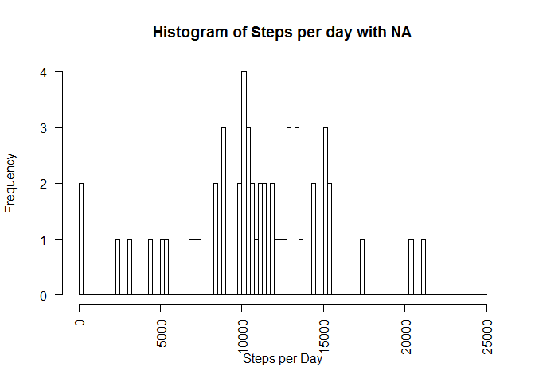
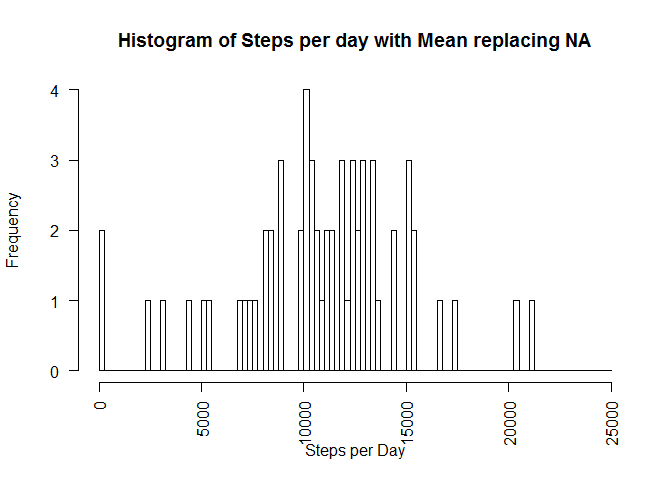
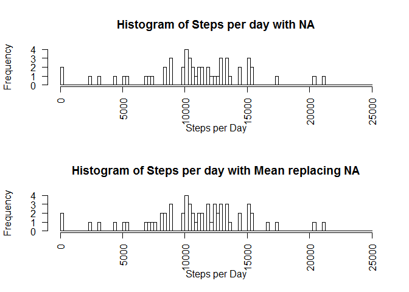
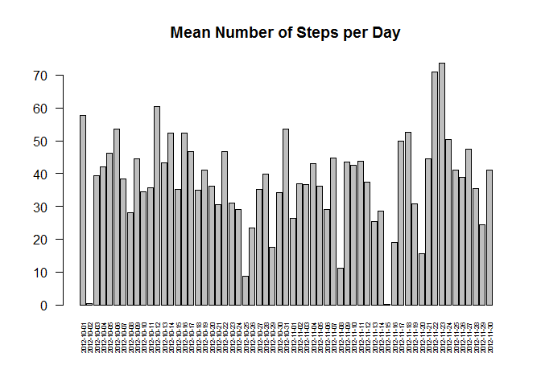
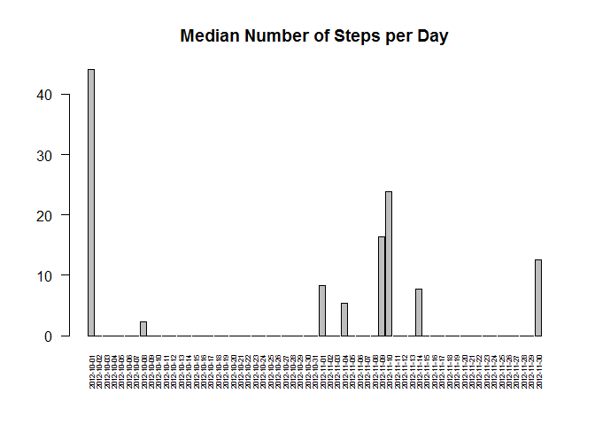
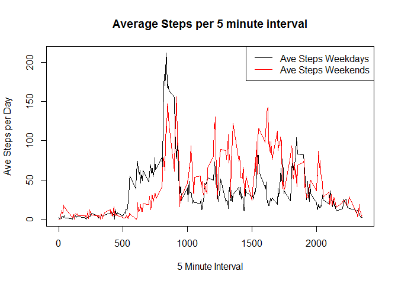

# Reproducible Research: Peer Assessment 1


## Loading and preprocessing the data


```r
# set working directory
setwd("C:/Coursera/data")
# testing
act <- read.csv("activity.csv", sep = ",", stringsAsFactors = FALSE)
```

## What is mean total number of steps taken per day?  

```r
# Calculate the total number of steps taken per day

sumstep <- aggregate(steps~date, data = act, sum)

# create a histogram of the total # of steps taken each day

hist(sumstep$steps, seq(0,25000,l=101), las=2, xlab="Steps per Day",
     main="Histogram of Steps per day with NA")
```



## What is the average daily activity pattern? 

```r
act1 <- aggregate(steps~interval, data=act,mean, na.rm=TRUE)
plot(act1$interval , act1$steps, xlab="5 Minute Interval", ylab="Average Steps",
     main="Time Series Plot of Mean Number of Steps Taken at 5 Minute Intervals", type ="l")
```


```r
#Which 5-minute interval, on average across all the days in the dataset, 
#contains the maximum number of steps?
j <- subset(act1, act1$steps == max(act1$steps, na.rm = TRUE))
print(paste("Across all of the days, interval",j[1],"has the maxium number of setps" ))
```

```
## [1] "Across all of the days, interval 835 has the maxium number of setps"
```


## Imputing missing values

```r
# Calculate and report the total number of missing values in the dataset 
# (i.e. the total number of rows with NAs)
tna <- act[is.na(act$steps),]
cnt_of_NA <- dim(tna)
print(paste("There are",cnt_of_NA[1],"rows that are missing data in the data set"))
```

```
## [1] "There are 2304 rows that are missing data in the data set"
```

```r
##########################################################################################
# fill in missing values
# Devise a strategy for filling in all of the missing values in the dataset. 
# The strategy does not need to be sophisticated. For example, 
# you could use the mean/median for that day, 
# or the mean for that 5-minute interval, etc.fill in missing values
#3.	Create a new dataset that is equal to the original dataset but with the missing data filled in.
##########################################################################################
# make a temporary dataframe
actw <- act
# add a column for day of week Sunday through Saturday
actw$day <- weekdays(as.Date(act$date))
# put all days with NA in one data frame and all days without NA in another dataframe
tna <- actw[is.na(actw$steps),]
ta <- actw[!is.na(actw$steps),]

#find the mean at each interval time of each day
int_day <- aggregate(steps~interval+day, data = ta, mean)
temp <- merge(tna, int_day, by=c("day","interval"))
#replace NA with mean 
tna$steps <- temp$steps.y

# new data frame without NA
actn <- rbind(ta,tna)

# Make a histogram of the total number of steps taken each day and Calculate and report 
# the mean and median total number of steps taken per day. Do these values differ from the 
# estimates from the first part of the assignment? What is the impact of imputing missing data 
# on the estimates of the total daily number of steps?
# Are there differences in activity patterns between weekdays and weekends?
# For this part the weekdays() function may be of some help here. Use the dataset with the 
# filled-in missing values for this part.
sumstep <- aggregate(steps~date, data = actn, sum)
# create a histogram of the total # of steps taken each day
hist(sumstep$steps,  breaks=seq(0,25000,l=101),  las=2,  xlab="Steps per Day",
     main="Histogram of Steps per day with Mean replacing NA" )
```



```r
#draw comparison chart
par(mfrow = c(2, 1) )
sumstep <- aggregate(steps~date, data = act, sum)
# create a histogram of the total # of steps taken each day
hist(sumstep$steps, seq(0,25000,l=101), las=2,  xlab="Steps per Day",
     main="Histogram of Steps per day with NA")

sumstep <- aggregate(steps~date, data = actn, sum)
# create a histogram of the total # of steps taken each day
hist(sumstep$steps, seq(0,25000,l=101),  las=2,  xlab="Steps per Day", 
     main="Histogram of Steps per day with Mean replacing NA" )
```



```r
# return the display to normal
par(mfrow = c(1, 1) )

# create bar chart of mean of the steps per day
meanstep <- aggregate(steps~date, data = actn, mean)
barplot(meanstep$steps, names.arg =meanstep$date, 
        main="Mean Number of Steps per Day",las=2, cex.names = 0.50)
```



```r
# create bar chart of median of the steps per day
medianstep <- aggregate(steps~date, data = actn, median)
barplot(medianstep$steps, names.arg =medianstep$date, main="Median Number of Steps per Day", las=2, cex.names = 0.50)
```




## Are there differences in activity patterns between weekdays and weekends?

```r
################################################################################
##  Weekdays and Weekends
################################################################################
actw <- actn

j <- c("Saturday", "Sunday")
actw$dayend <- ifelse(actw$day %in% j , "Weekend", "Weekday")
actw$dayend <- factor(actw$dayend)
act_end <- actw[actw$dayend=="Weekend",]
act_day <- actw[actw$dayend=="Weekday",]

step_day <- aggregate(steps~interval, data=act_day, mean)
step_end <- aggregate(steps~interval, data=act_end, mean)
plot(step_day$interval, step_day$steps, type="l", main="Average Steps per 5 minute interval", 
     xlab="5 Minute Interval", ylab = "Ave Steps per Day")
lines(step_end$interval, step_end$steps, col="red")
legend("topright", legend=c("Ave Steps Weekdays","Ave Steps Weekends" ), col=c("black","red"), lty=1)
```


